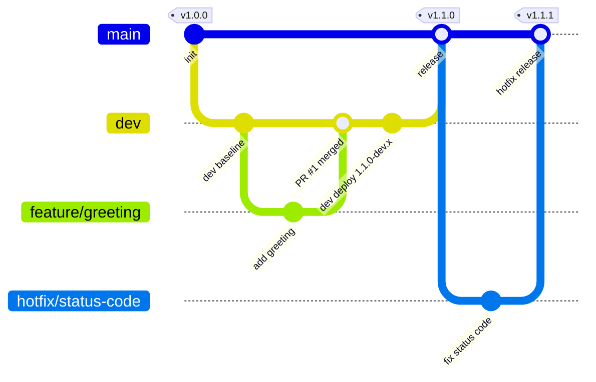
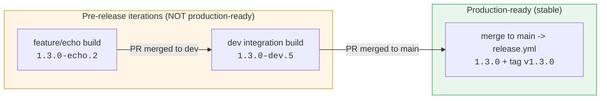

# Branching Strategy & Semantic Versioning

A GitFlow-style model that maps each branch type to a CI/CD behavior and a distinct
SemVer, computed automatically by **GitVersion** (`GitVersion.yml`).

## Branches

| Branch | Purpose | Branches from | Merges to | CI/CD behavior | Example version |
|--------|---------|---------------|-----------|----------------|-----------------|
| `main` | Production. Every commit is a release. | — | — | `release.yml`: prod deploy + tag `vX.Y.Z` + GitHub Release | `1.2.0` |
| `dev` | Integration branch. | `main` | `main` | `deploy-dev.yml`: deploy persistent `dev` env | `1.3.0-dev.4` |
| `feature/*` | New functionality. | `dev` | `dev` (PR) | `pr-validation.yml`: tests + ephemeral env + smoke | `1.3.0-<branch>.2` |
| `hotfix/*` | Urgent prod fix. | `main` | `main` (PR) | `pr-validation.yml`, then `release.yml` on merge (patch bump) | `1.2.1-beta.1` → `1.2.1` |

## Flow diagram

## How versioning works

- `GitVersion.yml` computes the version from the current branch + latest tag on `main`.
- Feature branches inherit the pending minor bump and are labelled with the branch name, so
  a reviewer instantly sees which branch produced a build.
- `main` builds are **stable** (no pre-release label); the release workflow tags `v<MajorMinorPatch>`.
- Hotfix branches bump **patch** off the latest release.

### Bumping major/minor

GitVersion honors commit-message increments by default. Influence the bump with a commit message trailer:

- `+semver: major` → next release bumps the major (e.g. `1.4.2` → `2.0.0`)
- `+semver: minor` → next release bumps the minor
- default → patch

## The transition point: feature iteration → production-ready

The single most important SemVer concept for this pipeline is **where a version stops being a
pre-release iteration and becomes a production-ready release**. That happens at exactly one place:
the **merge into `main`**, which triggers `release.yml`.

Everything before `main` carries a **pre-release label** (the `-something` suffix). Pre-release
versions sort *below* their stable counterpart (`1.3.0-dev.4` < `1.3.0`), which is precisely how
SemVer encodes "not done yet".

Concrete example of one feature's version as it flows through the branches (latest prod tag = `v1.2.0`):

| Stage | Branch | Example version | Production-ready? | Why |
|-------|--------|-----------------|-------------------|-----|
| Development | `feature/echo` | `1.3.0-echo.3` | No | Branch-labelled pre-release; each push increments the counter |
| Integration | `dev` (after PR merge) | `1.3.0-dev.5` | No | `dev`-labelled pre-release; validated on the persistent dev env |
| **Release** | `main` (after PR merge) | **`1.3.0`** | **Yes** | Stable — the label is dropped and `release.yml` tags `v1.3.0` |
| Urgent fix | `hotfix/x` | `1.2.1-beta.1` | No | Patch pre-release off the latest tag |
| **Hotfix release** | `main` | **`1.2.1`** | **Yes** | Stable patch, tagged `v1.2.1` |

The pre-release *counter* (`.3`, `.5`) increments automatically per commit so every CI build is
uniquely and monotonically versioned; the *label* (`echo`, `dev`, `beta`) tells you the origin.

## Related

- CI/CD pipeline stages, SIT, and selective per-service deploys → [`CICD_PIPELINE.md`](CICD_PIPELINE.md)
- Merging many feature branches into `dev` safely → [`CONCURRENT_DEVELOPMENT.md`](CONCURRENT_DEVELOPMENT.md)
- Two credential sets across simulated environments → [`MULTI_ENVIRONMENT.md`](MULTI_ENVIRONMENT.md)

## Why this maps cleanly to a demo

Each branch type produces an observable, different outcome (ephemeral env vs dev deploy vs
tagged prod release), and the version string alone tells you where a build came from.
See `docs/DEMO_SCRIPT.md` for the exact walkthrough.
