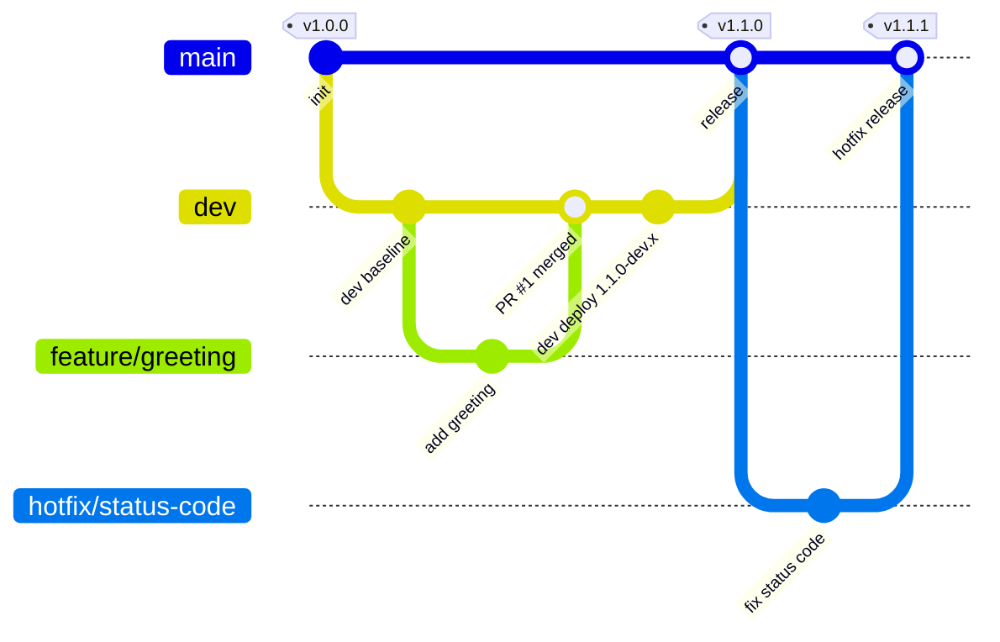

# Branching Strategy & Semantic Versioning

A GitFlow-style model that maps each branch type to a CI/CD behavior and a distinct
SemVer, computed automatically by **GitVersion** (`GitVersion.yml`).

## Branches

| Branch | Purpose | Branches from | Merges to | CI/CD behavior | Example version |
|--------|---------|---------------|-----------|----------------|-----------------|
| `main` | Production. Every commit is a release. | — | — | `release.yml`: prod deploy + tag `vX.Y.Z` + GitHub Release | `1.2.0` |
| `dev` | Integration branch. | `main` | `main` | `deploy-dev.yml`: deploy persistent `dev` env | `1.3.0-dev.4` |
| `feature/*` | New functionality. | `dev` | `dev` (PR) | `pr-validation.yml`: tests + ephemeral env + smoke | `1.3.0-<branch>.2` |
| `hotfix/*` | Urgent prod fix. | `main` | `main` (PR) | `pr-validation.yml`, then `release.yml` on merge (patch bump) | `1.2.1-beta.1` → `1.2.1` |

## Flow diagram

## How versioning works

- `GitVersion.yml` computes the version from the current branch + latest tag on `main`.
- Feature branches inherit the pending minor bump and are labelled with the branch name, so
  a reviewer instantly sees which branch produced a build.
- `main` builds are **stable** (no pre-release label); the release workflow tags `v<MajorMinorPatch>`.
- Hotfix branches bump **patch** off the latest release.

### Bumping major/minor

GitVersion honors commit-message increments by default. Influence the bump with a commit message trailer:

- `+semver: major` → next release bumps the major (e.g. `1.4.2` → `2.0.0`)
- `+semver: minor` → next release bumps the minor
- default → patch

## Why this maps cleanly to a demo

Each branch type produces an observable, different outcome (ephemeral env vs dev deploy vs
tagged prod release), and the version string alone tells you where a build came from.
See `docs/DEMO_SCRIPT.md` for the exact walkthrough.
