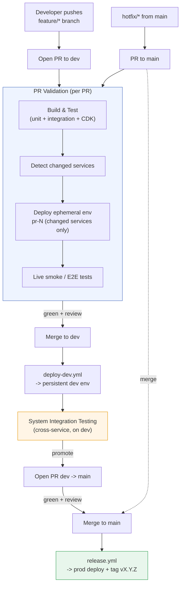
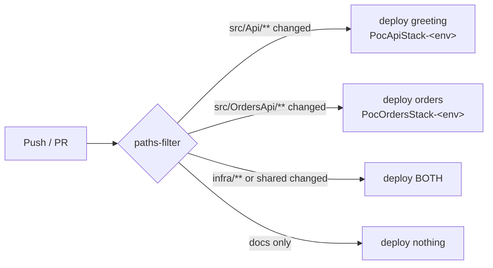

# CI/CD Pipeline & GitOps Flow

This document is the visual companion to the pipeline: the end-to-end GitOps flow, the test
stages (including system integration testing), and how the pipeline **selectively deploys only
the microservices that changed**.

## End-to-end GitOps flow

Git is the single source of truth. A change is promoted **feature → dev → main**, and each
promotion is a merge that triggers a distinct workflow. No environment is ever mutated by hand.

## Test stages (defense in depth)

Each tier runs where it is cheapest and fastest to catch a class of defect.

| Tier | Where it runs | Scope | Speed | Gate |
|------|---------------|-------|-------|------|
| **Unit** | Every PR + every push (`_build-test.yml`) | Pure business logic (`GreetingService`, `OrderService`) | ms | Blocks merge |
| **Integration (in-memory)** | Every PR + every push | Full ASP.NET pipeline via `WebApplicationFactory`, no network | sub-second | Blocks merge |
| **Infra assertions** | Every PR + every push | CDK synth → CloudFormation template assertions | seconds | Blocks merge |
| **Smoke / E2E** | After each deploy (ephemeral, dev, prod) | Real HTTP against the deployed API Gateway + Lambda | seconds | Blocks promotion |
| **System Integration Testing (SIT)** | On the persistent `dev` env after `deploy-dev.yml` | Cross-service behavior with real AWS wiring | minutes | Gate for `dev → main` |

### Where SIT fits

Unit/integration tests prove a service is correct **in isolation**. SIT proves the services are
correct **together**, on infrastructure that mirrors prod, before anything is promoted to `main`.
In this POC the persistent `dev` environment is the SIT environment: both the greeting and orders
services are deployed there, so cross-service scenarios (and contract expectations) can be exercised
against live endpoints. The `dev → main` PR is the human gate that says "SIT passed, promote".

## Selective (per-service) deployment

The repo is a monorepo with two independently deployable microservices. The pipeline avoids
redeploying everything on every change:

1. `_changes.yml` runs `dorny/paths-filter` and emits `greeting`, `orders`, and `infra` booleans.
2. Each deploy job deploys a service **only** if its files changed. A change under `infra/`,
   `.github/`, the solution, or `GitVersion.yml` sets `infra=true`, which forces a full deploy of
   both services (shared surface area changed).
3. Each service is its own CloudFormation stack (`PocApiStack-<env>` for greeting,
   `PocOrdersStack-<env>` for orders). The CDK app synthesizes only the requested service via
   `-c service=<greeting|orders>`, so a single-service deploy never touches the other stack.

**Demo takeaway:** change only `src/OrdersApi`, open a PR, and the run log shows the greeting
deploy step *skipped* while only the orders stack updates — the pipeline surgically updates the
one microservice that changed.

## Mapping to files

| Concern | File |
|---------|------|
| Fast test gate (reusable) | `.github/workflows/_build-test.yml` |
| Change detection (reusable) | `.github/workflows/_changes.yml` |
| SemVer computation (reusable) | `.github/workflows/_version.yml` |
| Per-service deploy (composite) | `.github/actions/deploy/action.yml` |
| PR validation + ephemeral | `.github/workflows/pr-validation.yml` |
| Ephemeral teardown | `.github/workflows/pr-cleanup.yml` |
| Dev CD | `.github/workflows/deploy-dev.yml` |
| Prod release | `.github/workflows/release.yml` |
