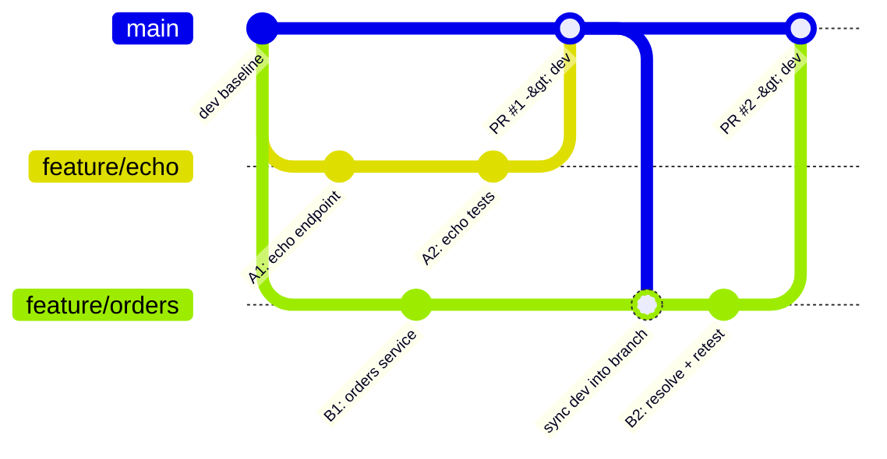
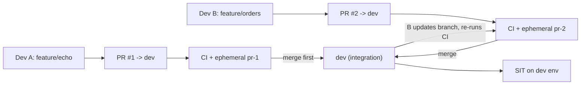

# Concurrent Development: Many Feature Branches → One `dev`

How the process lets multiple developers work in parallel and merge their feature branches into
`dev` safely, without stepping on each other.

## The model

Every developer cuts their own `feature/*` branch from `dev`, and integration happens **only**
through reviewed pull requests. `dev` is the shared integration branch; it is never committed to
directly.

> In the graph, `main` stands in for the shared `dev` line for readability; both PRs target `dev`.

## What keeps concurrent merges safe

1. **Isolation per PR.** Each PR gets its own ephemeral environment (`pr-<number>`) with uniquely
   named stacks and resources (`poc-*-pr-<number>`). Two open PRs never share infrastructure, so
   one developer's in-flight change cannot break another's environment or tests.

2. **Selective, independent deploys.** Because each microservice is its own stack and the pipeline
   deploys only what changed, a PR touching `orders` and a PR touching `greeting` deploy disjoint
   resources — no contention even in the shared `dev` environment.

3. **Branch protection + up-to-date requirement.** `dev` (and `main`) require: green
   `Build & Test`, a passing PR validation, at least one review, and the branch to be current with
   its base before merge. This forces the second PR to reconcile with the first *before* it lands.

4. **Merge order is explicit.** When PR #1 merges to `dev`, PR #2's branch is now behind. The author
   merges/rebases `dev` back into their feature branch, re-runs CI (tests + ephemeral smoke on the
   updated code), resolves any conflict locally, and only then merges. The pipeline re-validates the
   *combined* result, not just the isolated feature.

5. **Deterministic, non-colliding versions.** GitVersion labels each feature build with its branch
   name and an auto-incrementing counter (`1.3.0-echo.3`, `1.3.0-orders.2`). No two concurrent
   branches produce the same version, and once merged, `dev` builds get a single `-dev.N` sequence.

## Handling conflicts

- **Code conflicts** surface at the "update branch" step and are resolved by the PR author; CI then
  re-runs on the merged content so a resolved-but-broken merge is still caught.
- **Resource conflicts** are designed out: physical names are environment-scoped, and ephemeral
  envs are per-PR, so parallel work does not collide in AWS.
- **Optional hardening:** enabling a **merge queue** on `dev` serializes the final integration —
  GitHub builds each PR against the latest base in order, guaranteeing `dev` is always green even
  under heavy concurrent merge pressure.

## Concurrent flow, end to end

