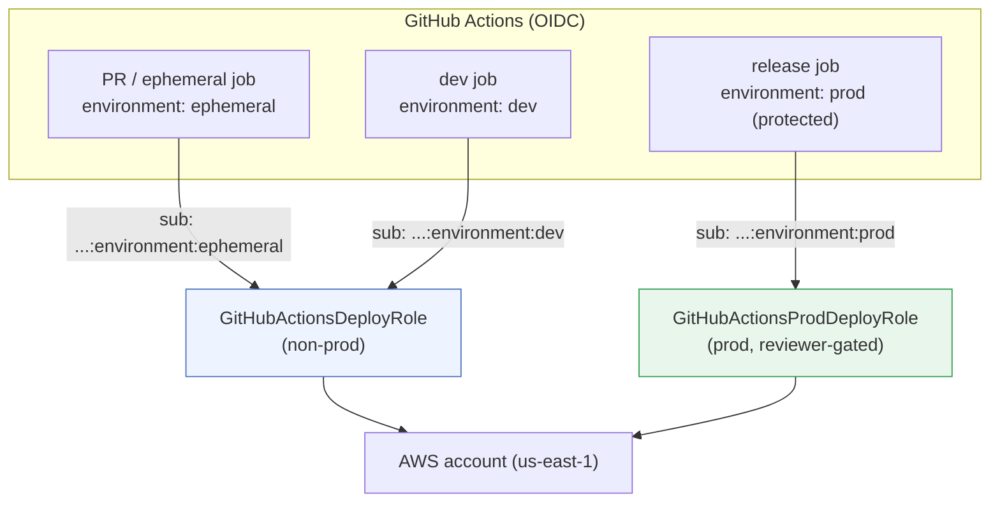

# Multi-Environment Deployment with Two Credential Sets

The pipeline uses **two distinct IAM roles** to segregate non-production from production, and
routes each GitHub Environment to the correct role. This mirrors the real-world pattern of
separate non-prod and prod AWS accounts while using a single free-tier account for the POC.

## The two credential sets

| Credential set | IAM role | Assumed by | Trust scope (OIDC `sub`) |
|----------------|----------|------------|--------------------------|
| **Non-prod** | `GitHubActionsDeployRole` | ephemeral PR envs, `dev`, cleanup | `repo:ORG/REPO:*` (any ref/environment) |
| **Prod** | `GitHubActionsProdDeployRole` | production releases only | `repo:ORG/REPO:environment:prod` (only the protected `prod` environment) |

> **Important — immutable subject ids.** GitHub issues this repo's OIDC tokens with **immutable
> numeric ids** in the subject claim, e.g.
> `repo:pbandi3@309149007/aws-poc-microservice-platform@1314266439:environment:dev`. The plain
> `repo:ORG/REPO:...` form does **not** match, so both trust policies (`iam/github-oidc-trust-*.json`)
> match the immutable form (with the plain form kept as a fallback). If you fork/rename the repo,
> update the numeric ids in the `iam/` files and `scripts/*.sh` (`GITHUB_ORG_ID`/`GITHUB_REPO_ID`).

The prod role's trust policy **rejects any OIDC token** whose subject is not
`repo:ORG/REPO:environment:prod`. A feature or PR build — which never runs in the `prod`
environment — physically cannot assume production credentials, even though everything shares one
AWS account. This is the segregation-of-duties story without needing a second account.



## How the role is selected

Every deploy job declares a GitHub `environment:` and passes `role-arn: ${{ secrets.AWS_ROLE_ARN }}`.
Because `AWS_ROLE_ARN` is defined as an **environment-scoped secret**, GitHub automatically injects
the right value per environment — no branching logic in the workflow:

| GitHub Environment | `AWS_ROLE_ARN` secret value | Protection |
|--------------------|-----------------------------|------------|
| `ephemeral` | non-prod role ARN | none |
| `dev` | non-prod role ARN | none |
| `prod` | **prod role ARN** | **Required reviewer** (manual approval before prod deploy) |
| _repository-level_ | non-prod role ARN | used by `pr-cleanup` (no environment) |

## Setup

1. Ensure the OIDC provider + CDK bootstrap exist (`scripts/aws-bootstrap.sh`, already run).
2. Create both roles:

   ```bash
   bash scripts/aws-setup-multienv-roles.sh
   ```

   It prints both role ARNs and the exact secret wiring.
3. In **Settings → Environments**, create `ephemeral`, `dev`, and `prod`. Add a **Required reviewer**
   to `prod`.
4. For each environment, add an environment secret `AWS_ROLE_ARN` per the table above. Keep the
   repository-level `AWS_ROLE_ARN` = non-prod role for the cleanup workflow.

## Why this is the right pattern

- **Blast-radius isolation:** compromised PR/feature automation can only ever touch non-prod.
- **Least privilege by environment:** each role can later be scoped to only the resources its
  environment owns (the POC uses broad perms for reliability; production would tighten each role).
- **Human gate on prod:** the `prod` environment's required reviewer means a person approves before
  the prod role is ever assumed — combining OIDC trust scoping *and* an approval gate.
- **Account-portable:** to graduate from "two roles in one account" to "two accounts", only the
  environment secret values change; the workflows are untouched.
